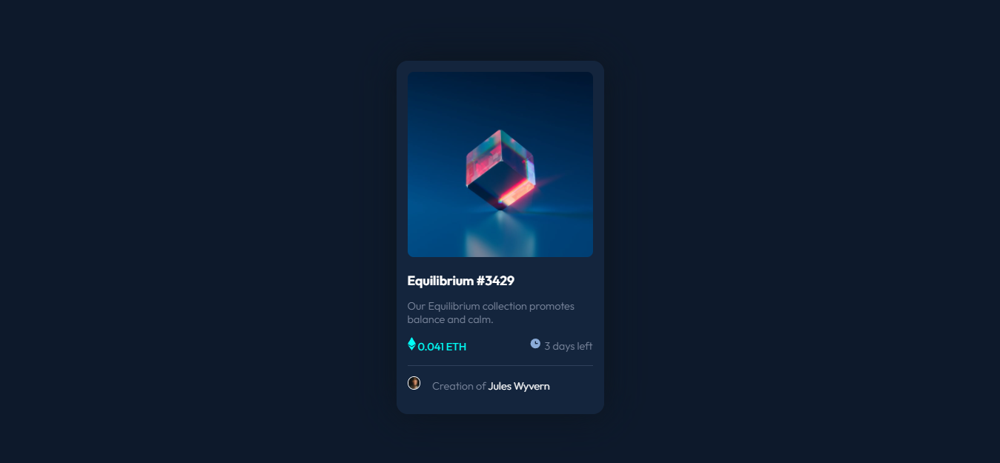

# Frontend Mentor - NFT preview card component solution

This is a solution to the [NFT preview card component challenge on Frontend Mentor](https://www.frontendmentor.io/challenges/nft-preview-card-component-SbdUL_w0U). Frontend Mentor challenges help you improve your coding skills by building realistic projects. 

## Table of contents

- [Overview](#overview)
  - [The challenge](#the-challenge)
  - [Screenshot](#screenshot)
  - [Links](#links)
- [My process](#my-process)
  - [Built with](#built-with)
  - [What I learned](#what-i-learned)
  - [Continued development](#continued-development)
- [Author](#author)
- [Acknowledgments](#acknowledgments)


## Overview

### The challenge

Users should be able to:

- View the optimal layout depending on their device's screen size
- See hover states for interactive elements

### Screenshot



### Links

- Solution URL: [Add solution URL here](https://your-solution-url.com)
- Live Site URL: [Add live site URL here](https://your-live-site-url.com)

## My process

### Built with

- Semantic HTML5 markup
- CSS
- Flexbox

### What I learned

In this project i learned to use more box-shadow and filter plus do some work with ::after and :hover.

To see how you can add code snippets, see below:

```html
<section class="card">
      <div class="images">
      </div>
      <article>
      <a href="" class="title">Equilibrium #3429</a>
      <p class="subtitle">Our Equilibrium collection promotes balance and calm.</p>  
      <div class="horizontal">
      <span class="ethnum"> 0.041 ETH</span>
      <span class="date"> 3 days left</span>
      </div>
      </article>  
      <p class="author-line">Creation of <a href="" class="author">Jules Wyvern</a></p>
</section>
```
```css
.images:hover::after {
    content: url(./images/icon-view.svg);
    height: 100%;
    display: flex;
    justify-content: center;
    align-items: center;
  }
```

### Continued development

I don't feel comfortable with the shadow, it's not like the design and i wanna know how to do it properly

## Author

- Author - [Francisco Agustín De La Colina Nieva]
- Frontend Mentor - [@agudlc](https://www.frontendmentor.io/profile/agudlc)
- Github - [agudlc](https://www.github.com/agudlc)

## Acknowledgments

To @hanka08.